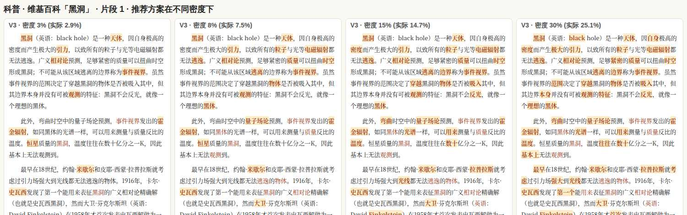
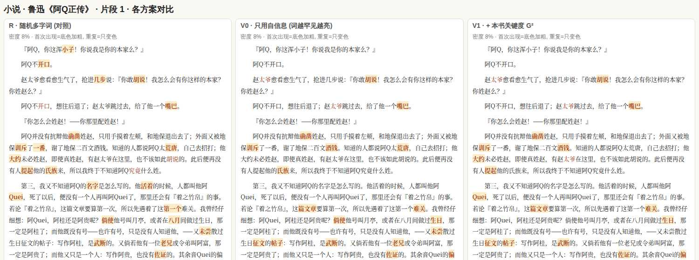

# 点睛阅读·基础版「点亮重点词」：基于信息量的选词算法调研与原型

> 2026-10-07。写给产品负责人和以后实现这个功能的开发者。
> 需求：基础版现在给所有多字词交替上色，用来标出词与词的边界。负责人希望基础版再增加一种用法：按信息熵挑出最有信息量的词，只点亮这些词。要求先查论文和专利，有现成方法就借鉴，没有就自己设计，并把原理讲清楚；同时为这个功能加使用统计，默认开启，界面上不做任何说明。
> 专利和论文暂不撰写，本文不起草权利要求，也不写论文。
> 原型代码：`docs/research/prototypes/keyHighlight.ts`（算法）、`run-key-highlight.ts`（评测和预览）、`sweep-key-highlight.ts`（参数扫描）、`explain-key-highlight.ts`（单段算例）、`key-highlight-gold/`（自标关键词）。本文没有改动 `src/` 下的任何文件。

---

## 0. 一页结论

**五个关键发现**

1. **单项算法都已有人做过，但没人把它们组合起来、用在阅读时点亮正文。** 自信息 / surprisal 与阅读时间的关系（Hale 2001、Levy 2008、Smith & Levy 2013、Shain 等 2024）、语料对比的关键度（Dunning 1993 的 G²、Tomokiyo & Hurst 2003 的逐点 KL）、词在全文中的空间聚集度（Ortuño 2002、Carpena 2009、Herrera & Pury 2008）都是成熟方法。最接近的产品研究是 GP-TSM（CHI 2024），它用大模型把不重要的词调灰，分好几级；Scim（IUI 2023）在论文里点亮要句，读者可以调密度。我们没有找到「背景词频自信息 + 本书关键度 + 空间聚集度，加上密度控制，离线点亮中文正文」的论文或专利。最接近的专利是 Amazon 的 Word Wise（US10417933B1、US9524298B2）：它也用罕见度加本书重要度来选词，并按密度控制，但用途是给词配释义；我们不配释义，所以不落入（§1.2）。
2. **只看「词有多罕见」几乎没用。** 只用自信息时，分数前 50 的词里平均只有 9% 是关键词（随机挑多字词是 1%），挑出来的多是「谁料、武断、国粹」这类罕见但无关紧要的词。**加上本书关键度（G²）后升到 26%。** 空间聚集度只多带来约 2 个百分点，而且不同文本上方向不一致。
3. **最大的提升来自「本书新词发现」：从 26% 升到 52%。** 词表里没有人名和术语（赵太爷、未庄、事件视界、报文段），词表把它们切碎以后，关键度就看不出它们重要。在每本书里先用凝固度和左右邻字熵把这些词找出来（Matrix67 2012 的公开做法），再加上两条我们新增的过滤（切分边界一致性、短语过滤），就能稳定地抓到人名和术语。
4. **密度要可调，默认值宜低。** 8% 密度下，科普和技术文本点亮的词里约 6 成是自标关键词；把密度调到 15% 以上，新增的大多是普通词。研究证据也支持少而准：点亮太多会抵消提示的作用（Lorch 等 1995），点错的提示会降低理解（Silvers & Kreiner 1997；Gier 等 2009），限制可标的数量反而能提高理解（Joshi & Vogel, CHI 2024，读者自己划线的实验）。建议滑条范围 2%–30%，默认 8%。小说里约一半的词是单字虚词，所以 30% 档实际只能点亮约 19% 的词，这在预期之内。
5. **很快，不增加下载。** 复用基础版已经加载的 6.6 万词表（常驻约 6 MB）。在服务器 CPU 上，整本书的新词发现加打分约 20–30 ms/万字，一本 24 万字的书约 0.5 秒；不发现新词时约 15–20 ms/万字。新词发现时内存瞬时峰值约 15–25 MB，结果可以按书缓存，约 2 KB。

**借鉴还是自研：借鉴各个零件，组合和选词规则自研。** 打分的三个量直接采用现有方法：自信息、Dunning G²、Carpena 聚集度 C，新词发现采用凝固度加邻字熵。下面这些是我们自己的设计：

- 把三项都换算成 nat 后直接相加；
- 门槛是软的：常用词只要在本书里关键度足够高，仍然可以参选；
- 新词发现增加了切分边界一致性和短语过滤；
- 选词规则：按章用二分法定阈值来控制密度，每句有上限，点亮的词不相邻，同一个词在一段里只亮一次，重复出现时分数按 ln(1+k) 衰减，第一次出现用强样式、之后用弱样式；
- 小说的关键度只用已经读过的部分来算，避免剧透（§6.4）。

**推荐算法（≤10 行）**

```
1  分词：沿用基础版的词表 DAG 切分；切分有歧义的词（unsure）不参选
2  新词：每本书统计 2–4 字片段，按凝固度 PMI ≥ 3.5、左右邻字熵 ≥ min(0.9, 0.8·ln f)、边界一致、不是短语筛选，加入本书词表
3  I(w) = −ln p_bg(w)，p_bg 用 Zipf 从词表名次估计：I = ln(名次+10) + ln H；新词按词表末位计
4  K(w) = ln(1 + G²)，G² = 2[f·ln(f/E) − (f − E)]，E = N·p_bg（f ≤ E 时 K = 0）
5  B(w) = clip(Carpena C, 0, 8)：相邻两次出现的间距的归一化标准差，按出现次数校正
6  S(w) = I + K + 0.5·B；第 k 次重复出现时减 ln(1+k)
7  参选：去掉停用词、数字、单字、名次 < 1500 的常用词（K ≥ 5 且名次 ≥ 200 时例外）
8  选词：每章二分查找阈值 θ，使点亮的词约占本章词数的 d（默认 8%，范围 2%–30%）
9  约束：每句最多 ⌈句内词数·d·2.5⌉ 个，点亮的词不相邻，同一个词在一段里最多亮一次
10 样式：第一次出现用强样式（底色加粗），之后用弱样式（只变色）；小说的 K 和 B 只用读到当前章为止的文本计算
```

---

## 1. 现有研究和专利

### 1.1 论文（引文已核对 DOI 或 ACL Anthology，个别页码未核）

| 方向 | 代表文献 | 和我们的关系 |
|---|---|---|
| **惊讶度与阅读** | Hale 2001（NAACL，doi:10.3115/1073336.1073357）；Levy 2008（*Cognition* 106(3)，doi:10.1016/j.cognition.2007.05.006）；Demberg & Keller 2008（*Cognition* 109(2)）；Smith & Levy 2013（*Cognition* 128(3)，doi:10.1016/j.cognition.2013.02.013）；Shain, Meister, Pimentel, Cotterell & Levy 2024（*PNAS* 121(10)，doi:10.1073/pnas.2307876121） | 读一个词花的时间与 −log P 成正比，在六个数量级上都是对数关系。这说明「信息量」这个量本身有认知依据。我们的 I(w) 是不看上下文的一元版本，因为离线算不起语言模型 |
| **词频与注视（含中文）** | Rayner 1998（*Psychol Bull* 124(3)）；Yan, Tian, Bai & Rayner 2006（*Br J Psychol* 97(2)，doi:10.1348/000712605X70066）；Rayner, Li, Juhasz & Yan 2005（*PB&R* 12(6)） | 中文读者的注视时间主要受**词频**影响，字频的影响小得多。所以我们按词打分，不按字打分 |
| **中文词界提示** | Bai 等 2008（*JEP:HPP* 34(5)）：加空格既没变快也没变慢；Perea & Wang 2017；Zhou 等 2018（*Mem Cogn* 46(5)）；Pan 等 2025（*PB&R* 32(2)，doi:10.3758/s13423-024-02581-6） | 交替上色能把落点引到词中间，对老年人帮助最大；**边界标错会造成损害**。这是现有基础版的依据，也说明切分出错是重点词方案的一个风险 |
| **关键度** | Dunning 1993（*CL* 19(1)，J93-1003）；Rayson & Garside 2000（W00-0901）；Tomokiyo & Hurst 2003（W03-1805，逐点 KL） | 我们的 K(w) 就是 Dunning 的 G²：比较本书词频和背景词频，对低频词也稳定 |
| **空间分布 / 熵** | Ortuño 等 2002（*EPL* 57(5)）；Carpena 等 2009（*PRE* 79, 035102）；Herrera & Pury 2008（*EPJ B* 63(1)）；Zhou & Slater 2003（*Physica A* 329）；Montemurro & Zanette 2002/2010；Mehri & Darooneh 2011；Yang 等 2013（*Physica A* 392(19)）；Altmann 等 2009（*PLoS ONE* 4(11)） | 关键词在文中扎堆出现，虚词则均匀分布。不需要参考语料，单本书就能算。我们的 B(w) 用 Carpena 的 C 值，也试过 Herrera–Pury 的分块熵 |
| **无监督关键词抽取** | TextRank（Mihalcea & Tarau 2004）；RAKE（Rose 等 2010）；YAKE!（Campos 等 2020，*Inf Sci* 509）；Hasan & Ng 2010（C10-2042）：tf-idf 是很难超过的基线 | 这些方法的输出是整篇文档的关键词列表，不决定正文里哪一处该点亮、点亮多少。我们借鉴了它们的思路（看位置和分布、不依赖训练），但输出的是逐处点亮的结果 |
| **中文新词发现** | Matrix67 2012《互联网时代的社会语言学：基于 SNS 的文本数据挖掘》（matrix67.com/blog/archives/5044）：凝固度 + 自由度（左右邻字熵） | 直接借鉴，另外加了两条过滤（§2.4） |
| **划线 / 提示对理解的影响** | Fowler & Barker 1974（*J Appl Psychol* 59(3)）；Lorch 1989（*Educ Psychol Rev* 1(3)）；Lorch, Pugzles Lorch & Klusewitz 1995（*CEP* 20(1)）；Silvers & Kreiner 1997；Gier, Kreiner & Natz-Gonzalez 2009（*J Gen Psychol* 136(3)）；Dunlosky 等 2013（*PSPI* 14(1)）；Schneider 等 2018（*Educ Res Rev* 23） | 提示能帮助记住被提示的内容，但提示太多就没有作用了，提示错了反而有害。这是「默认密度低、只点真重点」的依据 |
| **密度** | Joshi & Vogel 2024，*Constrained highlighting in a document reader can improve reading comprehension*（CHI '24，doi:10.1145/3613904.3642314）：127 人。读者**自己划线**时，限制最多只能标 150 个词的一组，理解成绩比不限量的一组高约 11% | 这是目前找到的唯一和「标多少」直接相关的证据，但实验里是读者自己标，不是系统点亮。没有找到「最优 10%–20%」之类的实证数字 |
| **最接近的产品研究** | **GP-TSM**（Gu, Arawjo, Li, Kummerfeld & Glassman, CHI '24，doi:10.1145/3613904.3642699）：用大模型把不重要的词逐级调灰，句子保持通顺。**Scim**（Fok 等, IUI '23，doi:10.1145/3581641.3584034）：论文要句分面点亮、分布均匀、密度可调。Rello 等 2014（W14-1204）：给读障者点亮关键词能提高理解 | 这几项思路相同，都是让重要的词或句先被看到，但 GP-TSM 和 Scim 依赖大模型或监督模型，而且做的是英文。我们是离线、按信息量计算、做中文、按词点亮，在产品里相当于智能版的离线版本 |
| **仿生阅读 / BeeLine 的实证** | Snell 2024，*No, Bionic Reading does not work*（*Acta Psychol* 247）；Parker 等 2026（*R Soc Open Sci* 13(9)，注册报告，90 人）；Beelders 2025；Readwise 2022（1,916 人）；Koornneef & Kraal 2022（BeeLine） | 「强调词的一部分就能读得更快」这个说法没有得到实证支持。这说明我们**不能在界面上承诺读得更快**，见 copy-guidelines 原则 7 |

调研时没有找到用关键词高亮做中文阅读实验的研究。

### 1.2 专利

（2026-10-07 检索，**这是一次技术现状检索，不是法律上的自由实施（FTO）意见**。服务器访问 Google Patents、Espacenet、EPO Register 都被拦截，所以：美国文献用 USPTO Patent Public Search 读了全文和权利要求；中国、日本、韩国、欧洲文献只看到网页搜索给出的标题和摘要片段，没有打开全文，也没有查 CNIPA。所有文献都没有查法律状态和年费缴纳情况。）

| 公开号 | 名称 / 申请人 | 优先权日 | 状态 | 权利要求要点 | 与我们的关系 |
|---|---|---|---|---|---|
| [US10417933B1](https://patents.google.com/patent/US10417933B1/en) | Selective display of comprehension guides / Amazon（Word Wise） | 2014-04-25 | 已授权，约 2034 年到期 | 用词在通用语料里的罕见程度加上在本书里的重要度打分，再按分数、出现次数和**已选词的密度**决定在哪一处显示释义。每一条独立权利要求都要求在词旁边显示**文字释义**，并且使用读者画像 | **重合最多的一件**：罕见度、本书重要度、按密度选词，这三点都有。区别是我们不显示释义，也不用读者画像。如果以后在点亮的词旁边加释义，就要先请法务看 |
| [US9524298B2](https://patents.google.com/patent/US9524298B2/en) | 同名 / Amazon | 2014-04-25 | 已授权，约 2034 年 | 难度分 = 语料词频 + 本书重要度 + **读者的查词历史**，然后显示释义 | 同一族。只要不用查词历史、不显示释义，就不落入 |
| [US20250315620A1](https://patents.google.com/patent/US20250315620A1/en) | Surfacing high-surprisal information / 芝加哥大学 | 2024-04-03 | **审查中** | 用语言模型根据前文预测每个词元，给每个词元一个惊讶值，然后突出显示 | 我们用的是不看上下文的词频表，不是语言模型逐词预测。**要持续关注**，审查中的权利要求可能被扩大或修改。对外介绍时不要把我们的方法说成「语言模型 surprisal」 |
| [US20170358238A1](https://patents.google.com/patent/US20170358238A1/en)（EP16001321.5、GB2552586A） | Speed reading system and method / Renato Casutt（Bionic Reading） | 2016-06-10 | 没查到美国授权，大概率已放弃 | 范围很宽：按规则给数字文本加可见的区分样式 | 可以当作对我们有利的现有技术：说明书写了按固定比例强调在**本文中很少重复**（1–3 次）的词，跳过高频词，2017 年已公开 |
| [US10453353B2](https://patents.google.com/patent/US10453353B2/en) | Reading comprehension apparatus / Full Tilt Ahead | 2014-12-09 | 已授权 | 词性标注加词汇库，给词排名后点亮排在前面的词 | 用的是人工词表，不是统计量，风险低 |
| [US12321685B2](https://patents.google.com/patent/US12321685B2/en) | NLP electronic passage curation / IBM | 2023-03-29 | 已授权 | 给电子书里的概念打分，再根据**阅读行为**加 softmax 决定调灰或上色的程度 | 不要用读者的阅读行为来决定点亮强度 |
| [US10169427B2](https://patents.google.com/patent/US10169427B2/en) | Personalized highlighter / IBM | 2015-11-25 | 已授权 | 记录阅读时间，推断兴趣，点亮相关内容 | 需要监测阅读行为，风险低 |
| [US7702611B2](https://patents.google.com/patent/US7702611B2/en) | Conceptual highlighting in electronic text / Xerox | 2005-01-07 | 大概率已到期 | 点亮与用户兴趣关键词匹配的句子 | 由用户驱动、按句点亮，属于现有技术 |
| [US9514121B2](https://patents.google.com/patent/US9514121B2/en) / [US9009028B2](https://patents.google.com/patent/US9009028B2/en)（CN104838414A） | Custom dictionaries for e-books / Google | 2012-12-14 | 已授权，约 2032 年 | 按阅读水平阈值从电子书里挑词，生成定制词典 | 生成词典，不是点亮 |
| [US10296644B2](https://patents.google.com/patent/US10296644B2/en) | Salient terms in captions / Microsoft | 2015-03-23 | 已授权 | 根据搜索日志，加粗搜索结果摘要里的显著词 | 领域和数据来源都不同 |
| CN106649666A、CN110826322A、CN104572622A | 新词 / 术语发现（词频 + 互信息 + 左右熵） | 不一 | 未核 | 用互信息和左右邻字熵发现新词 | 和我们的新词发现用的是同一类技术，但它们不涉及显示，而且这种方法是公开的教科书做法（Matrix67 2012 等）。只看了片段 |
| JP4533084B2 | 重要語提示装置 | — | 未核 | 片段显示它按词频和分布来提示重要词 | 可能和聚集度相关，**没能打开全文**，建议实现前人工查一下 |

产品方面：

- BeeLine Reader 的专利是 US9026907B2 和 US10102182B2（Indicators of text continuity，跨行颜色渐变，约 2031 年到期），和我们不重合。
- Spritz 的专利 US8903174B2、US9632661B2、US10712916B2 都是一次显示一个词（RSVP），不重合。
- 「BIONIC READING」是 BRCG Casutt GmbH 的注册商标，界面和宣传里不要用这个词。术语表也已经把「仿生阅读」列为不再使用的叫法。
- Microsoft Immersive Reader 没有找到相关专利。

**结论**：没有找到同时把「罕见度 + 本书关键度 + 空间聚集度」用在阅读时点亮的专利，也没有找到「电子阅读器里按用户设定密度点亮关键词」或「首次出现强于之后出现」的权利要求（USPTO 权利要求检索均为 0 篇）。

**需要注意的几点**：

1. 最接近的是 Amazon 的 Word Wise 两件，已授权，到 2034 年左右。我们不显示释义、不用读者画像和查词历史，所以不落入；**以后不要在重点词旁边加释义**，除非先请法务评估。
2. 芝加哥大学那件还在审查中，要持续关注。
3. IBM 那件提示我们，不要根据读者的阅读行为来调整点亮强度。

中国、日本、韩国和欧洲的覆盖只到片段级别。正式实现前，建议请专业检索员在 CNIPA 补查，并看一下 JP4533084B2。

完整检索词和命中数见附录 B。

### 1.3 结论

学术界有成熟的零件，没有完整方案。产品研究里最接近的是依赖大模型的 GP-TSM 和 Scim；专利里最接近的是 Amazon Word Wise，它用罕见度加本书重要度选词配释义。**借鉴零件（I、G²、C、新词发现），选词和展示规则自研；不加释义，不用读者的阅读行为或查词历史。**

---

## 2. 原理（大白话版）

### 2.1 一句话

一个词越**出人意料**（平时少见）、在**这本书里出现得越反常地多**、出现的位置越**扎堆**，就越可能是这本书讲的东西。这样的词先点亮，而且只点亮其中一小部分。

### 2.2 三个量

**① 自信息 I：这个词平时有多少见。** 信息论里，一件事的概率越小，它发生时带来的信息就越多：I = −ln p。p 是这个词在日常中文里出现的概率。我们的词表只记了 6.6 万个词的常用程度排名，没有词频，所以按 Zipf 定律从排名估计概率：第 r 名的词，p ≈ 1/((r+10)·H)，其中 H ≈ ln((词表大小+10)/10) ≈ 8.8。于是 I = ln(r+10) + ln H，单位是 nat。

- 词表分 24 档，同一档内的词共用一个代价（档首和档尾名次的几何平均），档内最多相差约 0.25 nat。对打分来说这个精度够用。
- 研究上的依据：阅读时间与 −log P 成正比（§1.1 的 Smith & Levy、Shain 等）。不过我们算的是**不看上下文**的一元概率；看上下文的 surprisal 需要语言模型，离线做不了。

**② 本书关键度 K：这个词在这本书里多出来多少。** 一个词在日常中文里的概率是 p，这本书一共 N 个词，那么它「理应」出现 E = N·p 次。实际出现了 f 次。f 比 E 多得越多，这个词越可能是本书的主题词。我们用 Dunning（1993）的对数似然比来衡量它多出来了多少：

  G² = 2·[ f·ln(f/E) − (f − E) ]（只在 f > E 时计算，否则 K = 0），K = ln(1 + G²)

G² 本身跨了好几个数量级，取对数之后才能和 I 直接相加。它的意思是「把背景语言换成这本书的语言，这个词多带了多少信息」，和 KL 散度属于同一族，Tomokiyo & Hurst 2003 称之为 informativeness。

**③ 聚集度 B：这个词是扎堆出现，还是均匀撒在全书。** 记下这个词每次出现的位置，算相邻两次出现之间的间距。虚词（「但是」「已经」）在全书里均匀出现，间距差不多大；主题词集中出现在讲到它的那几章，间距忽大忽小。用间距的标准差除以平均间距得到 σ：完全随机时 σ ≈ 1，越大越扎堆。Carpena 等（2009）对出现次数做了校正，得到 C 值（单位是标准差），这样常用词和罕见词可以放在一起比较。我们取 B = clip(C, 0, 8)。另一种算法是把全书切成 20 块，看这个词在各块里分布的熵（Herrera & Pury 2008）：熵越低越扎堆。实测 C 值略好（§4.3）。

**合起来**：S(w) = 1·I + 1·K + 0.5·B，三项的单位都是 nat 或接近 nat。B 的权重是 0.5，因为它在短文本里噪声大（出现次数少于 3 次时 B = 0）。

### 2.3 什么词不参选（惩罚）

- 停用词：约 140 个高频虚词、代词、副词，例如「我们 因为 已经 可以 这个 问题」；英文的 the、a、of 等。
- 数字和序数，例如「一二三 第一 两个」。
- 单字：原型的规则是只有名次在 2 万以后的单字才能参选，但词表里约 3,000 个单字的名次都在 2 万以前，词表外的字（例如「熵」）又按未登录字处理，所以**实际上单字都不参选**。单字术语（熵、猿）因此不会被点亮，见 §6.4。
- 太常用的词：名次排在前 1500 的不参选。这是**软门槛**：如果 K ≥ 5（大约是 G² ≥ 150，在本书里异常多）并且名次 ≥ 200，仍然可以参选。例如在讲黑洞的文章里，「质量」名次是 1294，但出现了 59 次，按背景频率只应出现约 0.5 次，所以它可以参选。
- 切分有歧义的词（基础版已经用的 unsure 标记）：标错边界的害处比不标更大（Pan 等 2025）。
- 密度调到 8% 以上时，这个门槛按比例放宽：minRank × 0.08/d，最低 300。否则 30% 档点不满。

### 2.4 本书新词：先让人名和术语成为一个词

词表里没有「赵太爷」「事件视界」「报文段」，切分时会切成「赵 | 太爷」「事件 | 视界」，打分就看不出它们重要。所以每本书先统计 2–4 字片段：

1. **凝固度**：把片段从任意位置拆成两半，取 PMI = ln(f(ab)·总字数 / (f(a)·f(b))) 的最小值，要求 ≥ 3.5。意思是两半「粘」在一起的程度远高于偶然。
2. **自由度**：片段左边和右边出现过的邻字各有多分散，用熵衡量，两边都要 ≥ min(0.9, 0.8·ln f)。否则它只是更长词的一部分，例如「赵太」后面总是跟着「爷」。
3. **边界一致性（我们加的）**：用原词表切分上下文时，如果有一个多字词跨过了片段的左右边界，比如「无法逃|逸」中的「逃逸」、「相对|论预测」中的「相对论」，就说明这个片段是两个词各取一半拼成的碎片。超过一半的出现是这种情况，就丢掉。这一条去掉了「无法逃、论预测、体一样、种可能性」等碎片。
4. **短语过滤（我们加的）**：词表切分后含助词片段（着、过、地、得、些，例如「张着嘴」「读过书」），以补语结尾（完、住、开、下去，例如「吃完」「拖下去」），或以虚的词组开头/结尾（两个、有些、觉得，例如「两个字」「觉得有些」），都丢掉。
5. 被更长的新词基本包含的片段丢掉，例如「赵太」包含在「赵太爷」里。
6. 留下来的新词加进**本书词表**（原词表不变），切分代价取「拆开后的最优代价」的一半，上限是第 3 万名词的代价，这样切分时会优先把它当成一个整词。打分时，新词的 I 按词表最末一名算。

实测找到的新词：《阿Q正传》44 个（赵太爷、未庄、假洋鬼子、土谷祠、邹七嫂…），《呐喊》113 个，「黑洞」25 个（事件视界、史瓦西、霍金辐射、吸积盘…），「传输控制协议」27 个（报文段、三次握手、拥塞控制、接收窗口…）。还剩下少量误判：旧白话词，例如「早经」「倒反」；动宾短语，例如「回过头」「叹一口气」。这些误判多数会因为分数低而不被点亮。

### 2.5 选词：控制密度，排布要好读

1. **按章定阈值**：在一章内用二分法找阈值 θ，使分数 ≥ θ 的词次大约占本章词数的 d。阈值按章统一，所以同一章里同一个词的取舍标准一致：一个术语不会这里亮、那里不亮，只会因为重复衰减而逐渐变弱。
2. **重复衰减**：一个词第 k 次出现（k 从 0 起，没点亮的出现也算），分数减 ln(1+k)。读者已经见过它，它带来的新信息变少了。
3. **首次出现强调**：在本书里第一次出现时用强样式（底色加粗），之后只用弱样式（变色）。
4. **每句上限**：每句最多点亮 ⌈句内词数 × d × 2.5⌉ 个，避免一句话亮成一片。
5. **不相邻**：两个点亮的词之间至少隔一个词，否则在视觉上会连成一条，看不出是两个词。
6. **一段一次**：同一个词在一段里最多点亮一次。

---

## 3. 算例：「黑洞」第一段（密度 8%，全书 5,368 词）

> 黑洞（英语：black hole）是一种天体，因自身极高的密度而产生极大的引力，以致所有的粒子与光等电磁辐射都无法逃逸。广义相对论预测，足够紧密的质量可以扭曲时空形成黑洞；不可能从该区域逃离的边界称为事件视界。虽然事件视界的范围决定了穿越黑洞的物体是否被吸入其中，但其边界本身并没有可被观测的特征：黑洞不会反光，就像一个理想的黑体。
>
> （维基百科「黑洞」，CC BY-SA 4.0；`node docs/research/prototypes/explain-key-highlight.ts <黑洞文本> 0`）

| 词 | 名次 | I（nat） | 本书次数 f | 理应次数 E | K=ln(1+G²) | B | **S** | 结果 |
|---|---:|---:|---:|---:|---:|---:|---:|---|
| 黑洞 | 20,735 | 12.1 | 187 | 0.03 | 8.0 | 8.0 | **24.1** | 点亮（首次，强） |
| 事件视界 | 新词 | 13.3 | 24 | 0.01 | 5.8 | 2.1 | **20.1** | 点亮（首次） |
| 引力 | 13,059 | 11.7 | 20 | 0.05 | 5.3 | 3.4 | **18.7** | 点亮 |
| 观测 | 5,180 | 10.7 | 28 | 0.12 | 5.5 | 4.6 | **18.6** | 点亮 |
| 天体 | 8,225 | 11.2 | 22 | 0.07 | 5.3 | 3.5 | **18.3** | 点亮 |
| 相对论 | 13,059 | 11.7 | 18 | 0.05 | 5.2 | 1.1 | **17.4** | 点亮 |
| 质量 | 1,294 | 9.4 | 59 | 0.47 | 6.1 | 2.8 | **16.9** | 点亮（软门槛放行） |
| 逃逸 | 32,922 | 12.6 | 6 | 0.02 | 4.1 | 0.2 | **16.7** | 点亮 |
| 黑体 | 32,922 | 12.6 | 4 | 0.02 | 3.6 | 0 | **16.2** | 点亮 |
| 英语 | 2,055 | 9.8 | 23 | 0.29 | 5.1 | 0.7 | 15.2 | 未点亮：分数过了阈值，但本句 6 个名额已经被更高分的词占满 |
| 反光 | 52,272 | 13.0 | 1 | 0.01 | 2.1 | 0 | 15.1 | 未点亮：很罕见，但全书只出现 1 次，K 低，刚好落在阈值 15.13 以下 |
| 广义 | 8,225 | 11.2 | 12 | 0.07 | 4.6 | 0 | 15.8 | 未点亮：本句 3 个名额给了相对论、质量、时空，而且它和「相对论」相邻 |
| 所有 | 513 | 8.4 | 5 | 1.16 | 2.1 | 0.2 | 10.6 | 不参选（常用词，K 不够高） |
| 一个 | 31 | 5.9 | 29 | 14.7 | 2.5 | 0 | 8.4 | 不参选（停用 + 太常用） |

这一段一共点亮 14 个词（本章阈值 θ ≈ 15.1；四句的名额分别是 6、3、2、7 个）：黑洞、天体、引力、粒子、电磁辐射、逃逸、相对论、时空、质量、逃离、事件视界、物体、观测、黑体（「黑洞」「事件视界」在同一段里再出现时不再点亮）。从表里可以看出三个量各自起的作用：

- **只用 I 会出错**：「反光」「理想」都是罕见词，但它们不是这篇文章讲的东西。K 低，就把它们压了下去。
- **K 把真正的主题词抬了上来**：「质量」很常用，I 只有 9.4，但它在本书里多出了 100 多倍，K = 6.1，所以仍然能参选并被点亮。
- **B 区分了同样常见的词**：「观测」（B = 4.6，集中出现在讲观测的几段里）比「边界」（B = 0，在全书均匀出现）更优先。

---

## 4. 原型与评测

### 4.1 文本与标注

| 体裁 | 文本 | 字数 | 来源与许可 |
|---|---|---:|---|
| 小说 | 鲁迅《阿Q正传》全文 | 21,339 | 维基文库（简体），公有领域 |
| 科普 | 维基百科「黑洞」正文 | 10,527 | zh.wikipedia，CC BY-SA 4.0（不是公有领域，只放在本地评测，文中只引用一段） |
| 技术 | 维基百科「传输控制协议」正文 | 9,418 | 同上 |
| 整本书 | 鲁迅《呐喊》12 篇（按篇作为章） | 59,078 | 维基文库，公有领域。已去掉版权模板文字，并把「硏 淸 靑」改回规范字 |

公有领域的中文科普和技术长文不好找，所以科普和技术两类用了 CC BY-SA 的维基百科条目。它们不随仓库分发，只在 `run-key-highlight.ts` 的注释里写明了用法。

**自标关键词**（`prototypes/key-highlight-gold/`）：每个文本由调研 agent 通读后标出 58–82 个「读者扫读时最该看到的词」，主要是人名、地名、术语和核心概念。**标注只有一人，而且偏重名词**，所以下面的数字只适合用来比较各方案的高低，不代表真实读者的感受。

**指标**（严格匹配，同一个词才算命中）

- P@50：分数最高的 50 个词里，有几个在自标关键词里。看排序准不准。
- hit：按某个密度点亮的所有词次里，关键词占多少。看点亮的东西准不准。
- rec：自标关键词里，有多少至少被点亮过一次。看有没有漏掉。

### 4.2 各方案对比（密度 8%；单元格依次为 P@50 / hit / rec）

| 方案 | 小说《阿Q正传》 | 科普「黑洞」 | 技术「TCP」 | 整本《呐喊》 | **平均** |
|---|---|---|---|---|---|
| R 随机挑多字词（对照） | 0.00 / 0.04 / 0.21 | 0.02 / 0.15 / 0.13 | 0.00 / 0.06 / 0.02 | 0.02 / 0.03 / 0.15 | 0.01 / 0.07 / 0.13 |
| V0 只用自信息 I | 0.08 / 0.04 / 0.33 | 0.16 / 0.13 / 0.35 | 0.10 / 0.06 / 0.14 | 0.04 / 0.01 / 0.21 | 0.09 / 0.06 / 0.26 |
| V1 I + 关键度 K | 0.28 / 0.14 / 0.38 | 0.42 / 0.42 / 0.40 | 0.16 / 0.19 / 0.16 | 0.16 / 0.06 / 0.26 | 0.26 / 0.20 / 0.30 |
| V2 + 聚集度（Carpena C） | 0.34 / 0.15 / 0.38 | 0.34 / 0.50 / 0.38 | 0.16 / 0.21 / 0.16 | 0.24 / 0.07 / 0.26 | 0.27 / 0.23 / 0.29 |
| V2e + 聚集度（分块熵） | 0.32 / 0.15 / 0.38 | 0.34 / 0.45 / 0.38 | 0.16 / 0.19 / 0.14 | 0.18 / 0.07 / 0.26 | 0.25 / 0.22 / 0.29 |
| **V3 + 本书新词（推荐）** | **0.40 / 0.27 / 0.60** | **0.62 / 0.63 / 0.65** | **0.46 / 0.57 / 0.41** | **0.60 / 0.18 / 0.62** | **0.52 / 0.41 / 0.57** |

分数最高的词（V3）：

- 小说：举人老爷 赵太爷 邹七嫂 革命党 未庄 姓赵 洋先生 王胡 假洋鬼子…
- 科普：黑洞 史瓦西 引力波 光子球 事件视界 电荷 太阳质量 奇点 坍缩…
- 技术：校验 发送方 接收方 报文段 字节 接收窗口 重传 时间戳 序号 端口号…
- 作为对比，V0（只用 I）在小说里排在最前的是：正传 文传 三教九流 言归正传 并不知道 酒钱…

整本《呐喊》的 hit 只有 0.18，这是因为 8% 一共点亮了约 1,300 种词，而自标关键词只有 82 个。这个数字低不说明选错了，看 P@50 和 rec 更合适。

### 4.3 参数扫描（`sweep-key-highlight.ts`，四个文本平均）

| 改动（其余同推荐） | P@50 | hit | rec | 说明 |
|---|---:|---:|---:|---|
| 推荐：α=1 β=1 γ=0.5，C 值，decay=1，minRank=1500，K 放行=5 | **0.520** | **0.411** | **0.572** | |
| γ=0（不要聚集度） | 0.505 | 0.390 | 0.561 | 聚集度只多 1–2 个百分点 |
| γ=1 | 0.510 | 0.400 | 0.568 | |
| 聚集度改用分块熵 | 0.475 | 0.395 | 0.568 | 短文本里分块熵噪声更大 |
| β=0.5 / β=2 | 0.510 / 0.515 | 0.375 / 0.414 | 0.564 / 0.555 | 效果对 β 不敏感，β=1 最稳 |
| α=0.5 / α=0（不要自信息） | 0.505 / 0.465 | 0.392 / 0.390 | 0.572 / 0.544 | 自信息单独用不行，但当作先验有用 |
| decay=0 / decay=2 | 0.520 / 0.520 | 0.414 / 0.334 | 0.530 / 0.589 | decay 在「准」和「全」之间取舍 |
| 硬门槛（不让常用词放行） | 0.515 | 0.411 | 0.568 | 放行主要救回「质量」这类词 |
| minRank=500 / 4000 | 0.520 / 0.520 | 0.411 / 0.410 | 0.572 / 0.558 | 不敏感 |
| 不做新词发现（= V2） | 0.270 | 0.230 | 0.289 | **影响最大的一项** |

### 4.4 密度（V3；单元格依次为实际占词数 / 实际占字数 · hit / rec）

| 设定 | 小说 | 科普 | 技术 | 整本书 |
|---|---|---|---|---|
| 3% | 3.0% / 4.8% · 0.58 / 0.45 | 2.9% / 3.9% · **0.88** / 0.43 | 2.9% / 3.8% · **0.71** / 0.26 | 3.0% / 4.5% · 0.44 / 0.60 |
| **8%（默认）** | 8.0% / 11.6% · 0.27 / 0.60 | 7.5% / 9.8% · 0.63 / 0.65 | 7.8% / 9.8% · 0.57 / 0.41 | 7.9% / 11.2% · 0.18 / 0.62 |
| 15% | 15.0% / 20.4% · 0.15 / 0.67 | 14.7% / 18.3% · 0.35 / 0.67 | 14.6% / 17.1% · 0.30 / 0.45 | 14.9% / 20.3% · 0.09 / 0.63 |
| 30% | **18.6%** / 24.9% · 0.12 / 0.71 | 25.1% / 30.7% · 0.22 / 0.67 | 26.4% / 32.3% · 0.16 / 0.45 | **18.9%** / 25.1% · 0.07 / 0.65 |

- 密度从 3% 调到 8%，召回明显增加；再往上调，新增的几乎都是普通词，hit 迅速下降。**默认 8%**：一行（约 20 个字）里大约点亮 1–2 个词。
- **小说在 30% 档只能点亮约 19% 的词**：小说里将近一半的词是单字（他、说、了），按规则不参选。这符合预期，因为把虚词点亮没有意义。
- 技术文本的召回停在 0.45 左右：自标关键词里有不少 5 字以上的术语（「用户数据报协议」「最大传输单元」），新词发现只找 2–4 字的片段，而词表把它们切碎了（§6.4）。

### 4.5 截图（Playwright 渲染原型 HTML 预览，已逐张查看）

- `docs/research/img/entropy-hl-science-density.jpg`：「黑洞」同一片段在 3% / 8% / 15% / 30% 下的效果
- `docs/research/img/entropy-hl-fiction-variants.jpg`：《阿Q正传》在随机、V0、V1、V2、V3 各方案下的效果
- `docs/research/img/entropy-hl-technical-variants.jpg`：「TCP」各方案对比
- 全部 16 张整页截图（4 个文本 × 2 个片段 × 方案对比或密度对比）：本次会话 scratchpad 的 `kh/shots/preview-*.png`，对应的 HTML 在 `kh/out/`，可以用 `run-key-highlight.ts` 重新生成

样式说明：第一次出现用浅色底加粗，重复出现只变色。

从截图里能看到：

- V0 点亮的「胡说、嘴巴、酒钱、武断」在 V3 里大多换成了「赵太爷、未庄、王胡」。
- 「黑洞」一段在 8% 时点亮了「天体、引力、粒子、电磁辐射、相对论、质量、事件视界、观测、黑体」，阅读时看起来还算稀疏。
- 30% 档开始点亮「最早、第一个、仅仅、大约」这类词，所以只适合想要更多提示的读者。





### 4.6 速度与内存（Intel Xeon Cascade Lake 4 核服务器，Node 24，单线程，5 次取中位数）

| 步骤 | 《呐喊》5.9 万字 | 《呐喊》×4 = 23.6 万字（相当于一本长篇） |
|---|---:|---:|
| 只分词（现在的基础版就要做这一步） | 8.5 ms/万字 | 8.5 ms/万字 |
| 新词发现（每本书做一次） | 8.6 ms/万字 | 6.6 ms/万字 |
| 带新词的切分 + 统计 | 21 ms/万字（含新词发现） | 15 ms/万字 |
| 打分 | 1.5 ms/万字 | 0.6 ms/万字 |
| 选词（含二分阈值） | 6.2 ms/万字 | 5.5 ms/万字 |
| **整本合计** | **约 29 ms/万字（0.17 秒）** | **约 21 ms/万字（0.5 秒）** |
| 新词发现时的堆峰值（采样估计） | 约 15 MB | 约 24 MB |
| 原型保留的堆（逐词对象） | 8.9 MB | 20.9 MB |

- 词表本身常驻约 6 MB（解析 36 ms），基础版本来就要加载，**新功能不增加下载**。
- 原型为了方便调试，给每个词次都保留了一个对象。产品实现里，每种词只保留出现次数和位置（Int32Array），一本书大约 1–2 MB；新词表和阈值缓存约 2 KB。
- 手机按比服务器慢 3–5 倍估算：一本 24 万字的书首次全书统计约 1.5–2.5 秒，放在 Worker 或空闲时间里做；之后打开每一章只需要切分加选词，一章 1 万字约 50–100 ms。

---

## 5. 推荐参数

| 参数 | 值 | 依据 |
|---|---|---|
| α, β, γ | 1, 1, 0.5 | §4.3：对 β 和 γ 不敏感；γ=1 已经略差；α=0 明显变差 |
| 聚集度 | Carpena C，截到 [0, 8]，出现次数 < 3 时为 0 | 比分块熵好 4.5 个百分点 |
| 重复衰减 | ln(1+k) | decay=2 召回更高但更不准；建议默认 1 |
| minRank / 放行 | 1500 / K ≥ 5 且名次 ≥ 200 | 不敏感；放行能救回核心常用词 |
| 新词 | 2–4 字，PMI ≥ 3.5，邻字熵 ≥ min(0.9, 0.8·ln f)，f ≥ max(3, 字数/2 万)，越界比 ≤ 50% | §2.4 |
| 密度 | 默认 8%，范围 2%–30%，按章控制 | §4.4；Lorch 1995、Joshi & Vogel 2024 |
| 每句上限 | ⌈句内词数 × d × 2.5⌉ | 一行不亮成一片 |
| 样式 | 首次出现用强样式，重复出现用弱样式；两个点亮的词不相邻；一段内同一个词只亮一次 | |

---

## 6. 产品建议

### 6.1 界面：基础版加一个「标出」选择

基础版的面板里，在颜色和强度上面加一组分段控件（`.segmented`）：

| 选项（功能名） | 一句话说明（≤24 字，按 copy-guidelines 先说好处） |
|---|---|
| **词与词** | 一眼分清词与词，长句读着不绕（即现在的按词分色，沿用文案规范里的示范句） |
| **重点词** | 每段最要紧的人名、术语先跳出来 |

- 选「重点词」时出现滑条，标题沿用「密度」（`dianjing.density`），两端写「更少」「更多」，参照 copy-guidelines §3.2.2 第 9 条的 Kindle 生词提示写法，**不显示百分比**。滑条内部映射到 2%–30%，默认位置对应 8%。
- 名字的结构保持一致：「词与词」「重点词」都是 3 个字，和智能版的「概念 / 要句」也不冲突。点睛阅读的副标题「让重点自己浮出来」正好可以概括「重点词」。
- **不要**把这个功能叫「高亮」或「划线」。按术语表，「划线」专指读者自己标的内容。
- 读英文书时，「重点词」先做成灰色不可选，在读者要做选择的地方平静地说一次：「英文书暂不支持重点词」。我们没有英文背景词频表；以后加上约 2 万词的英文频率表，就可以用同一套算法。
- 默认值：**老用户保持现在的「词与词」不变**。新安装先默认「重点词」还是「词与词」，建议用 §7 的统计做决定：可以先让新安装按 install ID 的哈希各分一半，比较 7 日功能留存。
- 切换时不弹窗，也不做引导。

### 6.2 与智能版的搭配

1. **作为智能版的离线兜底**：智能版本章还没处理完、离线或今日免费额度用完时，没处理到的部分可以先用「重点词」的弱样式顶上，智能版的结果到了再替换。两种标记同一时间只显示一种，`effectiveLevels` 的「同一时间至多一个版本」不变，只是把它当作智能版的过渡状态。
2. **给 AI 提示**：把本书新词表（人名、术语，约 100 个）和分数最高的词放进智能版的提示词里，作为「本书词汇表」，让它的「概念」标记前后一致，也能省一些 token。这些词本来就会随正文发出去，不增加新的数据外发。
3. **统一密度的含义**：两个版本的「更少 / 更多」都表示「标出多少」。读者从一个版本换到另一个版本时，不需要重新学。
4. **分工**：基础版「重点词」只点亮**词**，零延迟、不联网，适合任何书；智能版点出**要句**、概念和注释，能理解上下文，适合需要读懂的非虚构类书和论文。

### 6.3 体积与性能预算

| 项 | 预算 | 原型实测 |
|---|---|---|
| 新增下载 | 0（复用 zh-lexicon） | 0 |
| 代码 | ≤ 10 KB（压缩后） | 原型源码 20 KB，未压缩、含注释 |
| 首次全书统计 | 桌面 ≤ 1 秒，手机 ≤ 3 秒，在 Worker 或空闲时分片做，不阻塞翻页 | 23.6 万字约 0.5 秒（服务器） |
| 每章选词 | ≤ 50 ms（1 万字，桌面） | 约 6 ms 选词 + 9 ms 切分 |
| 常驻内存 | 词表 6 MB（已有）+ 每本书 ≤ 2 MB | 原型保留逐词对象，偏大 |
| 瞬时内存 | ≤ 30 MB；超过 50 万字的书只抽样统计前 30 万字 | 23.6 万字约 24 MB |
| 缓存 | 每本书 ≤ 4 KB（新词、各词出现次数的摘要、版本号），存 IndexedDB | 约 2 KB |

**全书统计怎么拿到**：foliate 按章节懒加载。第一次打开时先用**当前章**的文本当作「本书」来算：K 只用本章算，B 不算。同时在后台遍历全部章节，算完后换成全书统计。全书统计做一次，之后都用缓存。

### 6.4 风险

| 风险 | 影响 | 应对 |
|---|---|---|
| **点错比不点更糟**（Silvers & Kreiner 1997；Gier 等 2009） | 读者被引到不重要的词上 | 默认密度低（8%）；只有新词和关键度都可靠时才点亮；切分有歧义的不点亮 |
| **点太多就失效**（Lorch 等 1995） | 30% 档看起来像在给词上色 | 默认 8%；每句有上限；点亮的词不相邻；滑条不写百分比 |
| **剧透** | 全书关键度会让某个后来才变重要的人名在开头就很亮 | **小说的 K 和 B 只用读到当前章为止的文本算**，和智能版「小说只解释读过的内容」一致；体裁沿用智能版的自动识别。在《阿Q正传》9 章上试过：每章只用这一章及之前的文本做统计（包括新词发现），hit 从 0.278 降到 0.259，召回不变（0.586），代价很小 |
| 切分错误（Pan 等 2025：边界标错有害） | 半个词被点亮 | unsure 不点亮；新词要通过边界一致性检查 |
| 西文和汉字混排（阿Q、X射线、A股） | 主角「阿Q」一次都不会被点亮 | 实现时把「汉字 + 1–2 个拉丁字母」的组合当作一个词参与新词发现。另外，现有 `splitRuns` 会把「Q的名字」整段吞进西文词，原型里已经绕过（`segmentFixed`），产品里应该修 zhSegment |
| 5 字以上的术语（传输控制协议、用户数据报协议） | 只点亮其中一段 | 新词发现扩展到 6 字，或者把相邻的两个新词拼起来再检验一次 |
| 单字术语（熵、猿、碱） | 不会被点亮 | 单字只有在本书里关键度很高（K ≥ 6）且不是虚字时才放行 |
| 旧白话和文言 | 「早经」「倒反」被当成新词 | 分数低，基本不会被点亮；以后可以按体裁调阈值 |
| 繁体书 | 词表只有简体，切分质量下降 | 在查词表前先做繁简映射（只用于查表，不改正文） |
| 效果宣传 | 没有证据说明能读得更快 | 界面上不承诺效果（copy-guidelines 原则 7）；效果靠 §7 的统计观察 |
| 专利 | Amazon Word Wise 两件已授权，芝加哥大学一件在审 | 不在点亮的词旁边显示释义；不用查词历史和阅读行为来打分；对外不把方法叫作「语言模型 surprisal」；实现前请专业检索员在 CNIPA 补查，并看一下 JP4533084B2 |
| 评测偏差 | 只有一人标注，偏重名词，不是读者实验 | 上线后看 §7 的指标；需要时再做小规模可用性测试 |

---

## 7. 使用统计（默认开启，后台进行，界面不做说明）

沿用现有的匿名心跳（`docs/usage-stats-plan.md`、`src/services/usageStatsCore.ts`、`sync-server/src/stats.ts`），只加一块**按天汇总的计数**。所有计数只在**读中文书**时累计（书的语言为 zh*，或本章中文字符超过一半），这样不同模式之间的阅读速度才能比较。**不含书名、正文、书的 ID 或 hash、位置。**

### 7.1 上报内容

心跳在打开应用时发出，那时当天还没读书，所以**每次上报的都是已经过完的日子**。本机在 localStorage 里按本地日期累计；新的一天第一次心跳时，带上之前还没发出去的日子（最多 3 天，太旧的直接丢弃），服务端返回 2xx 后清掉。

```ts
// PingBody 新增可选字段 (旧客户端不带, 服务端照旧接收)
dj?: Array<{
  day: string                 // 本机日期 YYYY-MM-DD, 只能是已过完的一天 (≤ 今天-1, ≥ 今天-7)
  // 下面 4 元组都按点睛状态拆分: [关, 基础·词与词, 基础·重点词, 智能]
  min: [number, number, number, number]   // 阅读分钟 (取 readingClock 计入的秒数 /60, 每项 ≤ 1440)
  chars: [number, number, number, number] // 往前读过的字数 (翻过去那一页的可见字数之和; 滚动模式按滚过的屏数 × 每屏字数估算), 每项 ≤ 200 万
  fwd: [number, number, number, number]   // 往前翻页 / 往前滚过一屏的次数
  back: [number, number, number, number]  // 往回翻页 / 往回滚超过一屏的次数 (回读)
  density: number             // 当天「重点词」用得最久的密度设定 (2–30 的整数), 没用过为 0
  on: number                  // 打开点睛阅读的次数
  off: number                 // 关闭的次数
  quickOff: number            // 打开后 2 分钟内又关掉的次数
  styleSwitch: number         // 「词与词」和「重点词」之间切换的次数
  levelSwitch: number         // 基础版和智能版之间切换的次数
  densityChange: number       // 拖动密度滑条的次数 (松手算一次)
}>
```

- 服务端按 `parsePing` 的方式严格校验：多余字段丢掉，越界的值丢掉这一天的数据，**无论如何都不影响心跳本身被接收**。
- 新表 `dj_daily(day, install_id, platform, version, min_off, min_words, min_key, min_smart, chars_*, fwd_*, back_*, density, n_on, n_off, n_quick, n_style, n_level, n_density, PK(day, install_id))`。保留规则和 `pings` 一样：90 天后汇总进 `dj_rollup(day, version, …合计…, density_hist)` 再删除原始行。
- 客户端：阅读计时复用 `readingClock` / `library.addReadingTime` 的计入规则（空闲不计时），在落库时按当时的点睛状态归到对应的那一项；翻页方向用两次位置的比较来判断。和现有的统计一样，受 `settings.usageStats` 控制；在测试环境（`isTestEnvironment`）下不累计。

### 7.2 统计页上看什么、怎么判断

| 指标 | 算法 | 用来判断 |
|---|---|---|
| **采用率** | 当天 `min_key>0` 的安装数 ÷ 当天读了中文书的安装数（日 / 周） | 有多少人在用重点词；按版本切开看 |
| **时长占比** | 各模式分钟数 ÷ 中文阅读总分钟数 | 读者是只试一下，还是真的开着读 |
| **功能 7 日留存** | 第一次出现 `min_key>0` 的安装中，第 7 天（±1）仍有 `min_key>0` 的比例；和「词与词」、智能版并排看 | **最主要的成败指标**。重点词留存明显低于词与词时，说明选词或样式让人不舒服 |
| **秒关率** | `quickOff ÷ on` | 第一印象。超过 30% 时先怀疑默认密度太高或颜色太重 |
| **密度分布** | 用过重点词的安装中 `density` 的直方图；改过密度的人占多少；改过的人的中位数 | 改过的人超过一半、而且中位数离 8% 很远时，就把默认值调到那个中位数 |
| **阅读速度（配对）** | 同一个安装在同一周内，重点词和「关」各读满 10 分钟时，比较两者的 chars/min；取所有安装的比值中位数，用 bootstrap 求置信区间；另按 <150、150–300、300–450、450–600、600–900、>900 字/分钟分桶，看各模式的分布 | 只用来观察，**不对外宣称**。会选择打开重点词的人和书本身就不同（自选择），即使配对比较也不能当因果结论 |
| **回读率** | `back ÷ fwd`，按模式分别算，也做同一安装的配对比较 | 重点词下回读明显变多，可能是被点亮的词打断了阅读；明显变少则可能读得更顺。两种情况都要结合留存一起看 |
| **切换** | `styleSwitch`、`levelSwitch`，按人均和按版本看 | 频繁来回切换，说明两种方式各有缺点，或者读者对默认值不满意 |
| **版本对比** | 以上指标按 `version` 切开 | 每次调整算法以后，看留存和秒关率有没有变好 |

**怎么下结论**：功能留存和时长占比用来回答「有没有人愿意一直开着用」，这是主要依据。秒关率和密度分布用来调默认值。速度和回读率只用来发现异常，不作为效果证据。如果要比较默认值（例如新安装默认 6% 还是 10%，或者默认「重点词」还是「词与词」），按 install ID 的哈希分两组，客户端在后台决定，比较各组的 7 日功能留存和中文阅读分钟数。

---

## 附录 A：复现

```bash
# 文本放在一个目录, 每行一段, `### 篇名` 作章节分隔; 自标关键词在 docs/research/prototypes/key-highlight-gold/
node docs/research/prototypes/run-key-highlight.ts <texts> docs/research/prototypes/key-highlight-gold <out>    # 指标 + HTML 预览
node docs/research/prototypes/sweep-key-highlight.ts <texts> docs/research/prototypes/key-highlight-gold        # 参数扫描
node docs/research/prototypes/explain-key-highlight.ts <texts>/science.txt 0                                    # §3 算例
# 资源占用大的任务用 flock /tmp/heavy.lock nice -n 10 串行执行
```

文本来源：维基文库《阿Q正傳》（pageid 8047）和《吶喊》各篇；维基百科「黑洞」（pageid 19400）、「传输控制协议」（pageid 11146）。都通过 MediaWiki parse API 以简体变体取得，日期 2026-10-07，只保留 `<p>` 正文，去掉公式和引注。

## 附录 B：专利检索记录

检索工具：USPTO Patent Public Search（US-PGPUB + USPAT，全文和权利要求）；patents.google.com 的网页搜索（中、日、韩、英文关键词，只能看到标题和片段）。Google Patents 的 XHR 接口和详情页、Espacenet、EPO Register、Justia、FreePatentsOnline 都拦截了服务器访问。

| 检索式（USPTO） | 命中 |
|---|---:|
| highlight$ SAME entropy SAME word$ | 22 |
| highlight$ SAME (information ADJ content) SAME word$ SAME read$ | 7 |
| (emphasi$ OR highlight$) SAME (self ADJ information OR surprisal) SAME word$ | 2 |
| keyword + highlight + e-book + frequen$ | 4 |
| highlight/bold + rarity/word frequency + read + display | 19 |
| highlight + tf-idf/idf + read/display | 40（结果页上限） |
| highlight + burst/clustering/spatial distribution | 40（上限，无相关） |
| highlight + "log-likelihood" + keyword | 2 |
| skim/speed read + highlight + keyword + automatic | 6 |
| highlight + density/percentage + user/slider + read | 40（上限） |
| 权利要求：density + paragraph + user adjustment | **0** |
| 权利要求：first vs later occurrence | **0** |
| 权利要求：highlight + entropy/surprisal | 7 |
| 权利要求：importance + appearance frequency | 1 |
| 权利要求：occurrence position + variance/entropy/burst | 40（无相关） |
| 权利要求：left/right entropy + mutual information | 1（Tencent US9336197，语种识别） |
| "comprehension guide$" | 7 |
| high-surprisal / surprisal + highlight | 21 / 1 |
| casutt.IN. / bionic ADJ reading / beeline / spritz.AS. | 40 / 0 / 15 / 14 |

网页检索（patents.google.com）：「信息熵 关键词 高亮 阅读」「电子书 关键词 突出显示 词频」「新词发现 互信息 左右熵」「阅读 词语 重要度 颜色」「文本 关键词 加粗 高亮 速读」；日文「重要語 強調表示 電子書籍」；韩文「전자책 키워드 강조」；以及对应的英文检索式。网页检索不显示命中数。
